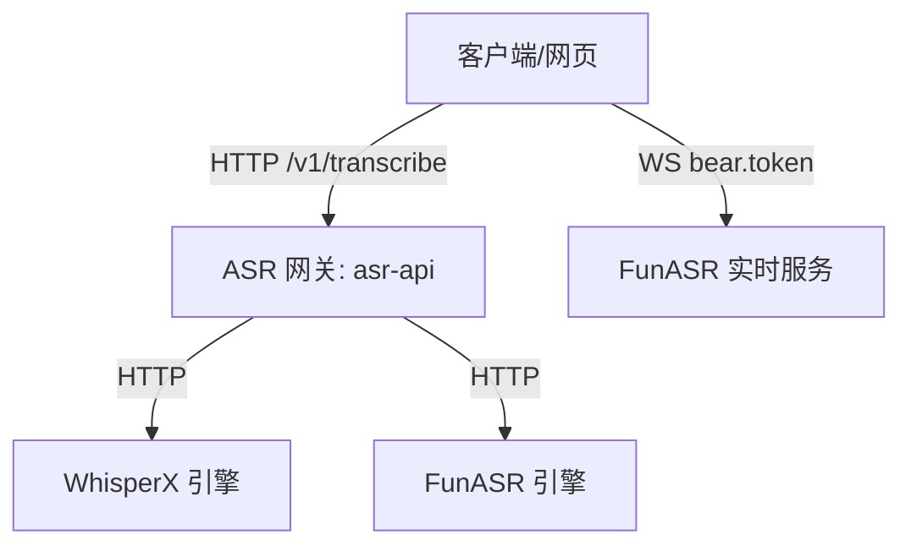

# ASR 本地启动与服务部署指南

本项目包含 ASR 语音识别相关的核心服务，支持通过一个内部 Docker 网络启动四个服务容器：`WhisperX`、`FunASR`、`FunASR 实时服务` 和 `ASR 网关 (asr-api)`。

同时，`asr-api` 网关支持**模块化开关配置**。在部分部署模式下，如果只需要依赖并暴露特定的模型（例如仅部署 WhisperX），可以通过启动环境变量控制网关，隐藏其他模型，使得网关对外看起来只支持特定模型。

---

## 架构与组件关系



- **ASR 网关 (asr-api)**：聚合后端各 ASR 引擎，提供统一的 RESTful API 接口，并内嵌 React 体验网页.
- **WhisperX**：离线转写引擎，适用于高质量离线音频的高精识别及时间戳对齐，默认加载 `large-v3` 模型。
- **FunASR**：离线转写引擎，适用于快速的多语言转写，默认加载 `sensevoice` 模型。
- **FunASR 实时服务**：高并发的双通道实时流式语音识别服务（支持 WebSocket 协议）。

---

## 镜像构建流程

所有业务镜像都依赖 `hub.aiursoft.com/aiursoft/internalimages/nvidia:latest` 基础镜像，因此必须先构建/配置基础镜像，再构建业务镜像。

### 1. 基础镜像的准备

在无法直连 Aiursoft 内网仓库 `hub.aiursoft.com` 时，可以先拉取 Docker Hub 官方镜像再重新打标签：

```sh
# 拉取 NVIDIA 官方 CUDA 基础开发镜像
docker pull nvidia/cuda:13.2.1-devel-ubuntu24.04
docker tag nvidia/cuda:13.2.1-devel-ubuntu24.04 hub.aiursoft.com/nvidia/cuda:13.2.1-devel-ubuntu24.04

# 构建项目统一的基础镜像
docker build -t hub.aiursoft.com/aiursoft/internalimages/nvidia:latest ./Nvidia
```

### 2. 业务镜像构建

```sh
# 构建离线引擎与网关服务
docker build -t funasr:local ./FunASR
docker build -t funasr-realtime:local ./FunASRRealtime
docker build -t whisperx:local ./WhisperX
docker build -t asr-api:local ./AsrApi
```

> **提示**：
> - `WhisperX` 在构建时会按照 `WhisperX/models_config.py` 中的 `BAKED_MODELS` 预下载模型权重并烘焙入镜像，因此首次构建拉取模型耗时较长，但运行期不需要连接公网下载模型。**如果希望只构建仅包含 `large-v3` 的精简镜像以减小体积（从约 16GB 减小），可在构建时传入 `--build-arg SINGLE_MODEL=true`。**
> - `asr-api` 采用多阶段构建，会自动调用 `node:24` 环境对 `web/` 前端进行编译，然后通过 `golang:1.24` 编译后端并打包成 Distroless 镜像。

---

## GPU 加速与环境配置

项目容器内默认启用了 GPU 加速，启动时需满足以下前置条件：

1. **宿主机安装 NVIDIA 驱动**：`nvidia-smi` 可正常输出。
2. **安装 nvidia-container-toolkit**：允许 Docker 容器访问宿主机显卡。
3. **运行时指定 GPU 参数**：在执行 `docker run` 时，必须添加 `--gpus all` 参数。

---

## 服务启动与参数配置

首先创建一个专用的 Docker Bridge 网络：
```sh
docker network create asr-net
```

### 1. 启动后端引擎服务

```sh
# 1. 启动 WhisperX 离线服务 (端口 8000)
docker run -d --name whisperx \
  --network asr-net --gpus all \
  -e ASR_WHISPERX_TOKEN=change-me-whisperx \
  -e WHISPERX_MODEL=large-v3 \
  -e WHISPERX_DEVICE=cuda \
  -e WHISPERX_COMPUTE_TYPE=float16 \
  whisperx:local

# 2. 启动 FunASR 离线服务 (端口 8000)
docker run -d --name funasr \
  --network asr-net --gpus all \
  -e ASR_FUNASR_TOKEN=change-me-funasr \
  -e FUNASR_MODEL=sensevoice \
  -e FUNASR_DEVICE=cuda \
  funasr:local

# 3. 启动 FunASR 实时流式识别服务 (端口 10095)
docker run -d --name funasr-realtime \
  --network asr-net --gpus all \
  -p 10095:10095 \
  -e ASR_REALTIME_TOKEN=change-me-realtime \
  -e ASR_REALTIME_DEVICE=cuda \
  -e ASR_REALTIME_NGPU=1 \
  funasr-realtime:local
```

---

### 2. 启动 ASR 网关 (asr-api) 及其开关控制

`asr-api` 支持通过下述环境变量进行模块开关定制：

| 环境变量 | 说明 | 默认值 |
| :--- | :--- | :--- |
| `ASR_ENABLE_WHISPERX` | 是否启用 WhisperX 引擎相关功能。若为 `false`，则无需提供 WhisperX 的 TOKEN 与 URL。 | `true` |
| `ASR_ENABLE_FUNASR` | 是否启用 FunASR 引擎相关功能。若为 `false`，则无需提供 FunASR 的 TOKEN 与 URL。 | `true` |
| `ASR_ENABLE_FUNASR_REALTIME` | 是否在网页端启用/显示实时麦克风识别卡片（WS连接）。 | `true` |

> **重要约束**：
> - `ASR_ENABLE_WHISPERX` 和 `ASR_ENABLE_FUNASR` 不能同时为 `false`。网关启动时必须至少有一个引擎处于启用状态，否则会报错并拒绝启动。

#### 场景 A：全模型启用模式（默认）
如果全部部署，则运行以下命令：
```sh
docker run -d --name asr-api \
  --network asr-net \
  -p 8080:8080 \
  -e ASR_API_TOKEN=change-me \
  -e ASR_WHISPERX_TOKEN=change-me-whisperx \
  -e ASR_FUNASR_TOKEN=change-me-funasr \
  -e ASR_WHISPERX_URL=http://whisperx:8000 \
  -e ASR_FUNASR_URL=http://funasr:8000 \
  asr-api:local
```

#### 场景 B：仅部署 WhisperX 模式（精简模式）
如果在生产中只打算部署 `WhisperX + large-v3`：
1. 无需启动 `funasr` 与 `funasr-realtime` 容器。
2. 启动 `asr-api` 时将 FunASR 和实时功能开关设为 `false`：
```sh
docker run -d --name asr-api \
  --network asr-net \
  -p 8080:8080 \
  -e ASR_API_TOKEN=change-me \
  -e ASR_ENABLE_FUNASR=false \
  -e ASR_ENABLE_FUNASR_REALTIME=false \
  -e ASR_WHISPERX_TOKEN=change-me-whisperx \
  -e ASR_WHISPERX_URL=http://whisperx:8000 \
  asr-api:local
```
此时，前端网页会动态响应此配置，隐藏 FunASR 相关的模型选择、页面文案与实时识别组件，使用户看起来该系统**天然只支持 WhisperX**。

---

## 运行维护与容器替换

如果要修改配置或更新镜像代码，需要删除旧容器并重新拉起：

```sh
# 停止并删除网关容器
docker stop asr-api && docker rm asr-api

# 重建网关镜像
docker build -t asr-api:local ./AsrApi

# 重新以新镜像拉起（参考上述启动命令）
```

---

## 接口与服务验证

### 1. 公开配置接口验证
网关提供了一个无需认证的公开配置端点 `/config`，以供网页端在初始化时拉取当前启用的模块信息。
```sh
curl -i http://localhost:8080/config
```
响应示例（若禁用了 FunASR 及实时识别）：
```json
{
  "funasr": false,
  "funasrrealtime": false,
  "whisperx": true
}
```

### 2. 网关系统健康与就绪检查
查询后端服务的就绪状态（`upstream_status` 变为 `available` 表明对应的后端离线引擎已加载完成并就绪）：
```sh
curl http://localhost:8080/v1/system \
  -H "Authorization: Bearer change-me"
```
*提示：如果禁用了某个引擎，对应的 `upstream_status` 在返回中会被标记为 `"disabled"`，且网关不会向上游发送检测请求，保障了单体部署时的稳定性。*

### 3. 转写接口调用测试
上传音频并使用已启用的模型进行识别：
```sh
# 使用 WhisperX 引擎（必须处于启用状态）
curl http://localhost:8080/v1/audio/transcriptions \
  -H "Authorization: Bearer change-me" \
  -F file=@meeting.wav \
  -F model=whisperx \
  -F level=large-v3
```
*注意：如果向已禁用的引擎发起转写请求，网关将直接返回 `400 Bad Request`，提示该模型不被支持或未启用。*

---

## 网页测试方法

1. 浏览器访问：`http://localhost:8080`
2. **输入 Token**：在“API Token”输入框中输入网关设置的 `ASR_API_TOKEN`（如 `change-me`）。输入后，页面将自动请求 `/v1/models` 并填充“模型档位”下拉菜单。
3. **选择模型**：在下拉菜单中选择对应模型与档位（如 `WhisperX` + `large-v3`），导入音频文件，点击**开始识别**即可。
4. **实时识别**：如果在配置中启用了实时流式识别卡片，在“实时麦克风识别”区域输入实时服务 Token，连接后即可使用麦克风直接体验低延迟的语音转写。
